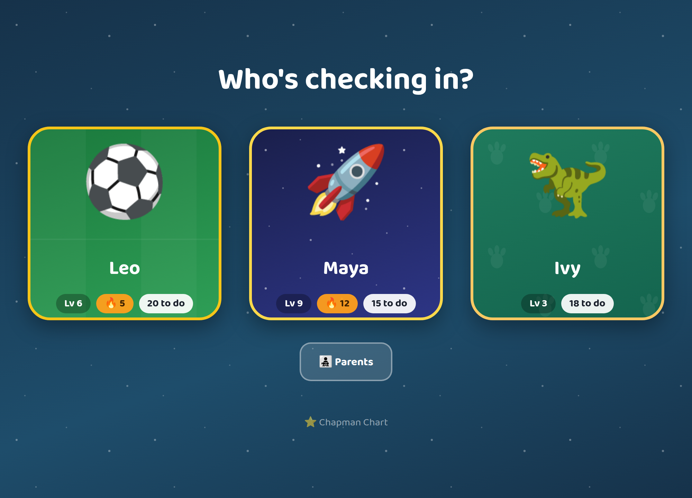
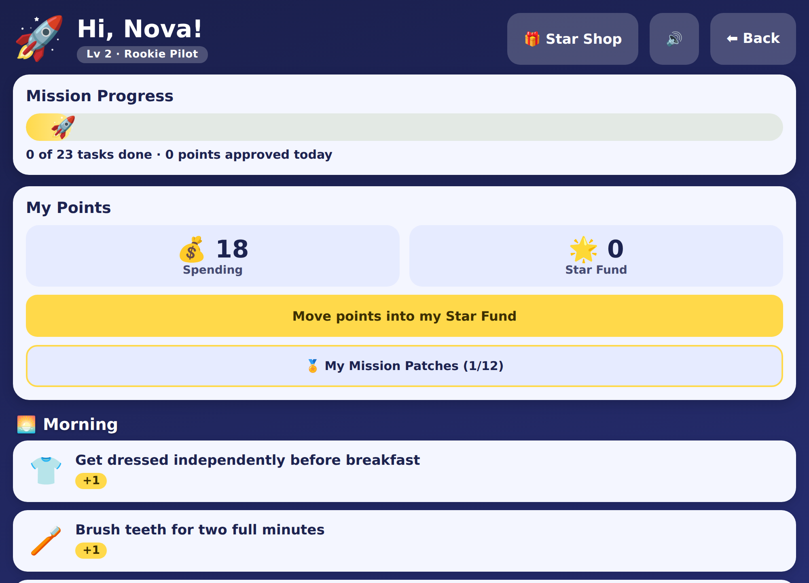
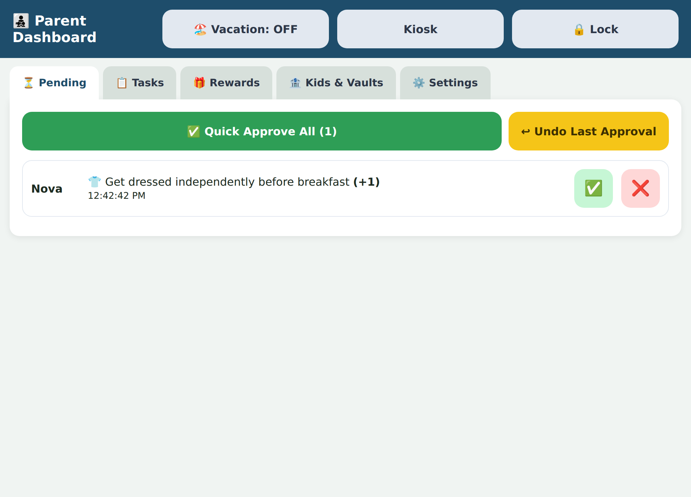
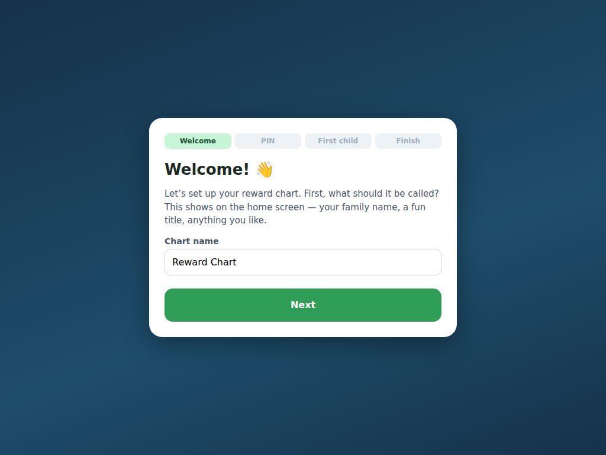

# Reward Chart

A self-hosted chore & reward system for families — a shared kiosk tablet the kids tap,
and a PIN-protected dashboard the parents run it from. Each child gets their own themed
world (soccer, dinosaur, space, fantasy, or racing) with its own colors, celebrations,
sounds, and vocabulary. Runs entirely on your own hardware; your family's data never
leaves the house.

**[▶ Try the live demo](https://chapdad031167.github.io/Kids-Reward-Chart-System/)** — the real app running entirely in your browser against fake data. Parent PIN `1234` (any code works); hit **Reset** in the corner to start over.

<p align="center">
  
  
</p>
<p align="center">
  
  
</p>

## Why I built this

Sticker charts on the fridge don't scale past one kid, don't teach saving, and turn into
a source of sibling comparison. I wanted something my kids would actually *want* to walk
up and use, that let them earn toward things they cared about, and that I could approve
from my phone without another cloud account holding my children's data. So I built it to
run on the home server next to the rest of the self-hosted stack — one container, one
SQLite file, no accounts, no internet required.

It's grown well past a sticker chart: a points economy with spending/saving vaults,
streaks, random mystery challenges, achievement badges, per-child levels, and a
cooperative family goal — but the core loop is still *tap a task → parent approves →
points land → celebrate.*

## Features

**For kids (the shared kiosk):**
- Tap an avatar to enter your own themed home screen — no password (or an optional
  3-emoji secret code so siblings can't open each other's).
- Big, tappable tasks grouped by category; tapping one plays a themed celebration
  (animation + synthesized sound) and queues it for a parent.
- A daily progress meter, a two-vault points economy (spend now vs. save up), streaks,
  a reward shop you browse and request from, and a savings goal you pick and watch fill.
- **Streak freezes** — a token a parent grants that spends itself automatically to cover
  one missed day, so a sick Tuesday doesn't erase a 30-day run.
- A **level bar** showing how close the next rank is ("20 more to Star Voyager"), so every
  approved task visibly moves something.
- **Mystery challenges** appear on random days — a glowing chest/egg/capsule that opens
  to reveal a bigger bonus task.
- **Badges, levels, and a cooperative family goal** for long-term motivation — kids only
  ever see their own numbers and a shared team bar, never a head-to-head comparison.
- After 90 seconds idle, the kiosk returns to the avatar screen on its own.

**For parents (the PIN-protected dashboard):**
- An approval queue with one-tap approve/reject, Quick Approve All, and Undo.
- Full management of tasks (with per-day-of-week schedules and one-tap Every day /
  Weekdays / Weekends presets), categories, rewards — including an optional **per-day
  cap** so "30 minutes of screen time" can't be cashed in five times before lunch — and
  each child's vault rules: manual saving or automatic split.
- Add/remove kids, switch a kid's theme, set secret codes, adjust balances, reset a day,
  bonus awards, a "to deliver" list so approved rewards don't get forgotten, and a
  fresh-start wipe (with an automatic safety backup).
- **Vacation mode** pauses the household and freezes streaks, and **school break days**
  are the lighter version — tasks still show, but a miss costs no streak.
- Optional **points → money**: set a per-kid rate and balances show a dollar value
  alongside the points. Off by default; the chart is about habits unless you say otherwise.
- **CSV export** of the full points ledger and task history — it's your family's data.
- **Quiet hours** silence the kiosk on every device between the times you pick —
  celebrations still play, they just don't wake the house at 6am.
- **Automated nightly backups** (downloadable from the dashboard) and an optional
  **weekly digest + push notifications** via [ntfy](https://ntfy.sh).

**Under the hood:**
- **Installable PWA** — add it to a tablet or phone home screen and it launches
  full-screen with its own icon, named after your chart. A service worker keeps the
  kiosk rendering through network blips (last-known data), and task taps queue in the
  browser and sync when the connection returns.
- Six fully-realized themes driven by a single config object, so adding a seventh is a
  data change, not a rewrite.
- Everything is a single SQLite file on a mounted volume; schema migrations run
  automatically on boot.

## Quick start

Runs anywhere Docker does — a home server, a NAS, or your laptop.

```bash
git clone https://github.com/chapdad031167/Kids-Reward-Chart-System.git
cd Kids-Reward-Chart-System
docker compose up -d --build
```

Open **http://localhost:8090** (or `http://<server-ip>:8090` from another device on your
network) and the **first-run setup wizard** walks you through naming the chart, choosing a
parent PIN, and adding your first child — no config files to edit. Then use **Add to Home
Screen** on the kiosk tablet and any phones — it installs as a proper full-screen app with
its own icon.

A pre-built image is also published to GHCR, so you can skip the build:

```yaml
services:
  reward-chart:
    image: ghcr.io/chapdad031167/kids-reward-chart-system:latest
    restart: unless-stopped
    ports:
      - "8090:8090"
    environment:
      - TZ=America/New_York          # local timezone — daily reset keys off this
      # - NTFY_URL=http://your-server:8093/reward-chart   # optional push notifications
    volumes:
      - ./data:/data                 # SQLite lives here — back up this folder
```

### Local development

```bash
# terminal 1 — API on :8090 (creates ./data/reward-chart.db)
cd server && npm install && npm start

# terminal 2 — Vite dev server on :5173, proxying /api to :8090
cd client && npm install && npm run dev
```

### The live demo

[`docs/index.html`](docs/index.html) is the real client bundle with
[`client/demo/mock-api.js`](client/demo/mock-api.js) in front of it: a `fetch` override that
answers `/api/*` out of `localStorage`. No server, no database — the whole thing runs in the
tab, which is why it can be a static GitHub Pages file.

```bash
cd client && npm run build:demo   # writes docs/index.html
```

CI regenerates and commits it on every push to `main`, so it can't drift behind the app the
way the previous hand-maintained version did. `docs/index.html` is **generated** — edit
`client/demo/` or `client/src/`, never the output. The starter task and reward library is
imported from [`server/src/seedData.js`](server/src/seedData.js) rather than copied, so the
demo shows the same content a real install seeds.

The mock deliberately stubs what has no meaning without a server — backups, ntfy delivery,
the PIN gate — and says so rather than faking them.

### Configuration

Everything is configured in the app (setup wizard + Settings tab). These env vars are
optional overrides for scripted deploys:

| Env var       | Default            | Purpose                                                    |
| ------------- | ------------------ | --------------------------------------------------------- |
| `PORT`        | `8090`             | HTTP port inside the container                            |
| `TZ`          | `America/New_York` | Local timezone for the daily reset and streaks            |
| `DATA_DIR`    | `/data`            | Where the SQLite file lives (mount a volume)              |
| `PARENT_PIN`  | `1234`             | Fallback PIN before setup runs; the wizard sets the real one |
| `APP_NAME`    | `Reward Chart`     | Fallback name before setup runs                           |
| `NTFY_URL`    | *(unset)*          | ntfy topic URL for push notifications; unset disables     |
| `BACKUP_KEEP` | `14`               | How many nightly database backups to retain               |
| `PUBLIC_URL`  | *(unset)*          | Address your phone can reach the chart on; enables approve buttons in notifications |

## Remote access for parents

The chart is LAN-only by design and stays that way — the data never leaves the house.
But that leaves a gap: ntfy tells you your kid did their chores while you're at work,
and then you can't do anything about it until you're home.

**The fix is a VPN overlay, not a port forward.** Tailscale puts your home server and
your phone on the same private network, end-to-end encrypted, with no port forwarding,
no inbound firewall holes, and no third party holding your family's data. The
"data never leaves the house" promise stays literally true — you're just extending
where "the house" reaches.

### 10-minute setup

1. **Install Tailscale on the machine running the chart** — <https://tailscale.com/download>.
   Sign in; the machine joins your private tailnet.
2. **Install Tailscale on the parents' phones** and sign in with the same account.
3. **Find the server's tailnet address** — `tailscale ip -4` on the server, or read it
   from the Tailscale admin console. It looks like `100.x.y.z`. Enabling MagicDNS gets
   you a name like `chart-server` instead.
4. **Check it works** — with your phone on mobile data (Wi-Fi off), open
   `http://100.x.y.z:8090`. The chart should load exactly as it does at home.
5. **Turn on one-tap approval** — put that same address into
   **Parent dashboard → Settings → Approve from your phone** (or set `PUBLIC_URL`).
   Push notifications now carry **✅ Approve** and **❌ Not yet** buttons, so a chore
   can be approved straight from the notification without opening the app or typing the PIN.

Those buttons carry a signed, single-use-shaped token: it authorises exactly one action
on exactly one item, expires after 12 hours, and grants nothing else — it is not a login,
and it cannot reach the rest of the parent API. Leave the address blank and notifications
still arrive, just without buttons.

### What about just forwarding a port?

Not supported, deliberately. The current auth is a 4-digit PIN sent as a header over
plain HTTP, and the kiosk API is unauthenticated by design because it's for kids on the
sofa. That's fine on a home LAN and nowhere near good enough for the open internet.
Making it internet-grade means TLS, session tokens, hashed credentials and CSRF
protection — a different project. The VPN route gets you the whole benefit today
without any of that risk.

## Tech stack & architecture

- **Frontend** — React + Vite. Custom themed components, no UI kit. Audio is synthesized
  live with the Web Audio API (no sound files). Offline tap queue in `localStorage`.
- **Backend** — Node.js + Express, SQLite via `better-sqlite3` (one file, easy backup).
  Small single-purpose modules — approval/streak/ledger logic, badges, vacation, backups,
  digest — behind a public kiosk router and a PIN-gated parent router.
- **Packaging** — multi-stage Docker build (Vite build served as static files by Express),
  one container, one mounted volume. CI publishes the image to GHCR on push.

```
server/
  src/db.js          schema + automatic migrations
  src/service.js     approval, streaks, ledger, undo, transfers, fresh-start
  src/badges.js      achievement badges + levels
  src/{vacation,backup,digest,familyGoal,bonus,schedule}.js
  src/routes/        kiosk.js (public) · parent.js (PIN-protected)
client/
  src/themes.js      per-theme config: colors, terminology, icons, sounds
  src/sounds.js      Web Audio synthesis
  src/screens/       Setup · AvatarSelect · KidHome · ParentDashboard
  src/components/     Celebration · ProgressMeter · EmojiPicker · KidCode · ui
```

## Design notes

A few decisions that shaped the app:

- **No cross-kid comparison, ever.** Each child sees only their own progress; the one
  shared surface is a *cooperative* family goal. This was a hard rule from day one — the
  point is to motivate each kid, not to rank them.
- **Two vaults, not one.** Points split into spending and saving. Younger kids can
  auto-split every earning; older kids choose what to move — a light, low-stakes way to
  practice the save-vs-spend decision.
- **Privacy by architecture.** Self-hosted and LAN-only means there's no account to
  create and no children's data in someone else's cloud — a deliberate design choice, not
  a limitation.
- **Themes are data.** Colors, vocabulary, celebration, and sound for each theme live in
  one config object, so the five themes share one codebase and a sixth is a small
  addition.

## License

[MIT](LICENSE) — free to use, modify, and self-host.
